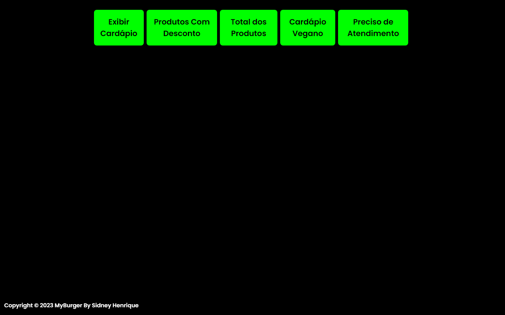

# Projeto Menu de Burgers

Um simples menu de burgers criado com HTML, CSS, JavaScript, jQuery e AJAX.

## Como Usar

* Clone o repositório em sua máquina local.
* Abra o arquivo `index.html` em um navegador web.

## Funcionalidades

* Exibe uma lista de burgers com preços.
* Exibe produtos com desconto.
* Exibe total de todos os produtos.
* Exibe somente produtos Veganos.
* Consulta CEP via API com AJAX

## Imagens do Projeto

## Requisitos

* Navegador web moderno.
* Conexão com a internet para funcionalidades AJAX.
* Clique aqui para
<a href="https://sidneyhenriquedev.github.io/myburger">Ver MyBurger ONLINE</a>

## Recursos

* [jQuery Documentation](https://api.jquery.com/)
* [MDN Web Docs - AJAX](https://developer.mozilla.org/en-US/docs/Web/Guide/AJAX)

## Contribuição

* Contribuições, problemas e melhorias são bem-vindos.
